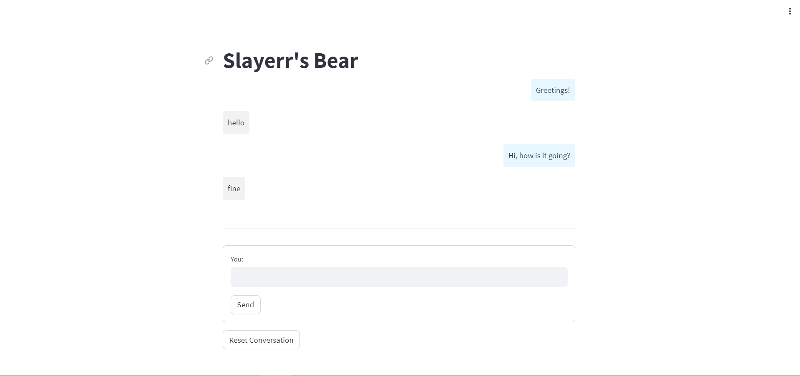

# Converstional Chatbot

This is a Python code that implements a chatbot using a sequence-to-sequence model with attention mechanism. The chatbot takes input sentences (questions) and generates corresponding output sentences (answers) in a conversational manner.

## Overview

The code is divided into the following main sections:

1. **Reading the Data**: The code reads input data from a file containing pairs of questions and answers.

2. **Tokenizing and Preprocessing**: The input sentences (questions and answers) are tokenized and preprocessed for further processing.

3. **Data Splitting**: The data is split into training and validation sets.

4. **Model Architecture**: The code defines the architecture of the encoder and decoder models. Attention mechanism is also used along with the encoder and decoder mechanism.

5. **Training Pipeline**: The training pipeline includes functions for training the model, calculating loss, and validating the model.

6. **Learning Rate Schedule**: An adaptive learning rate schedule is defined to adjust the learning rate during training.

7. **Training Loop**: The model is trained for a specified number of epochs using the defined pipeline.

8. **Model Saving**: The trained encoder and decoder models are saved to files and then zipped.

9. **Inference using Streamlit**: The user interface is created using Streamlit, a Python library for creating web applications. It allows users to input questions and displays the chatbot's responses in a chat-like format.

## Features

- User-friendly interface for interacting with the chatbot.
- Conversational responses generated using sequence-to-sequence models.
- Conversation history is displayed in a chat-like format.
- Reset button to clear conversation history.

## Requirements

- Python (tested with version 3.10.12)
- TensorFlow (tested with version 2.12.0)

## Usage

### For Training the Model

1. **Data Preparation**: Ensure that your data is formatted correctly where each line contains a question and its corresponding answer separated by a tab.

2. **Training**: Run the code to train the chatbot model. The trained encoder and decoder models will be saved to files "encoder_final" and "decoder_final."

### For Testing the Model in StreamLit

1. **Unzipping the Encoder and Decoder**: Unzip the encoder and decoder and give the path of both of them in the `app.py`. Also give the path of input and output tokenizers in the app.py

2. **Setup Dependencies**: Install the required dependencies by running `pip install tensorflow streamlit`.

3. **Run the Application**: Open your terminal or command prompt and navigate to the directory containing your code. Run the command `streamlit run app.py` to launch the Streamlit app.

4. **Chat with the Chatbot**: Once the app is running, you can interact with the chatbot. Enter your questions in the input box and press the "Send" button. The chatbot's responses will be displayed in the chat area.

5. **Reset Conversation**: If you want to clear the conversation history and start a new conversation, click the "Reset Conversation" button.

## Customization

Feel free to customize the code to suit your needs. You can modify the Streamlit UI, adjust the models' hyperparameters, or add more advanced features to enhance the user experience.

## Demo

## Credits

This code is created by Malik Shahzaib and is based on a sequence-to-sequence model with attention mechanism.

## License

This project is licensed under the [MIT License](LICENSE).
